# DevSecOps

## 1. Secure Software Development
### 1.1 Introduction to DevSecOps

Introduction 
**DevOps: A New Hope**

História do devops
- waterfall:
  - modelo de gerenciamento de projetos da década de 70, cada etapa é finalizada antes de dar início a próxima.
  - análise -> design -> implementação -> teste manutenção
- agile:
  - criado no início dos anos 2000 como forma de lidar com os problemas do modelo waterfall
  - permite mais flexibilidade e adaptalidade com foco em indivíduos e processos, software funcionando, colaboração com o cliente e resposta a mudanças
  - ao invés de processos sequenciais, a evolução do projeto passa por iterações que se repetem ao longo do desenvolvimento
- devops
  - surge como forma de lidar com os problemas que ainda existiam no modelo ágil
  - foco na automação e integração de sistemas, com a integração entre todos os departamentos (QA+sysadmins+desenvolvedores). Ex.: agora os desenvolvedores estão envolvidos com deploys
 
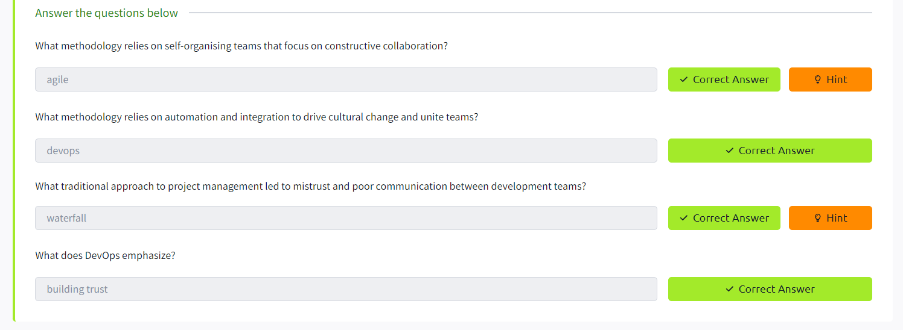

**The Infinite Loop**
- devops é visualizado como um loop infinito com todas as fases:
  - plan -> code -> build -> test -> release -> deploy -> operate -> monitor -> plan -> ...
- processos e ferramentas auxiliares do devsecops:
  - CI/CD: Continuous Integration and Continuous Deployment
  - Infrastructure as Code (IaC): gerencia e provisiona infraestrutura através de código e automação
  - Gerenciamento de configuração: gerencia o estado da infraestrutura e aplica as mudanças
  - Orquestração: automação de workflows
  - Monitoramento: coleta de dados sobre desempenho e estabilidade de serviços e infraestrutura
  - Microserviços: arquitetura que quebra uma aplicação em pedaços menores, tem como benefício a flexibilidade se for necessário escalar, reduzir escalabilidade e mais opções de escolha de tecnologias entre microserviços

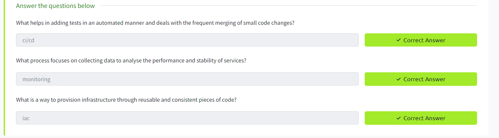

**Shifting Left**

- tradicionalmente os testes de segurança eram implantados no final do ciclo de desenvolvimento
- shifting left: implementar medidas de segurança nas etapas iniciais do desenvolvimento de software reduz o custos de remediação, constrói confiança, melhora a segurança e a qualidade do produto.

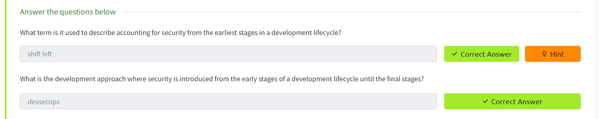

**DevSecOps: Security Strikes Back**
  - reduz o risco, auxiliando na prevenção de danos na reputação da marca, perdas financeiras relacionadas a incidentes de segurança e facilita a auditoria e monitoramento
  - desafios do devsecops:
    - silos de segurança: é comum que times de segurança sejam deixados de fora em processos de devsecops e serem vistos como uma entidade separada, pessoas especializadas que podem apenas manter e lidar práticas de segurança e como bloqueadores. A melhor prática é ter essas responsabilidades entre todos os membros do time ao invés de ter um engenheiro de segurança especializado
    - falta de visibilidade e priorização
    - processos rigorosos para todas as tarefas sem considerar o nível de risco

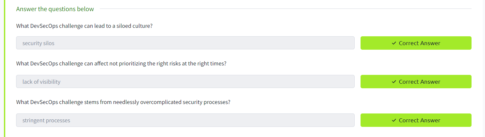

**DevSecOps Culture**
- promover autonomia dos times: é uma forma de fazer a segurança escalável sem depender de um profissional de segurança
- visibilidade e transparência: é uma forma de dar suporte a times em entender risco e educar sobre falhas de segurança
- flexibilidade devido a compreensão e empatia: fator chave para promover a segurança no processo de segurança

Exercise: Fuel Trouble
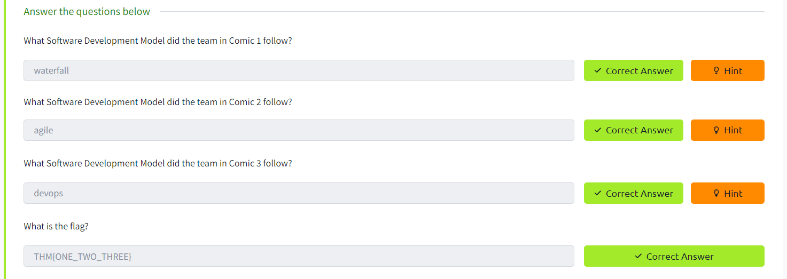

### 1.2 SDLC
Introduction

**SDLC**
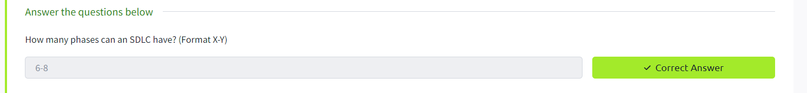

**SDLC Phases Part 1**

**SDLC Phases Part 2**
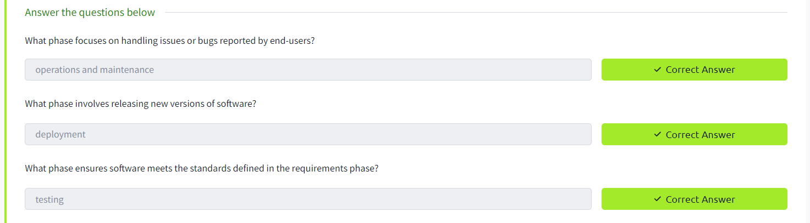

**Keep CALMS**
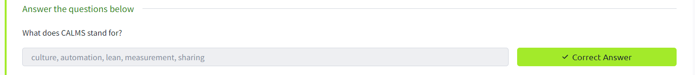

**DevOps Metrics**
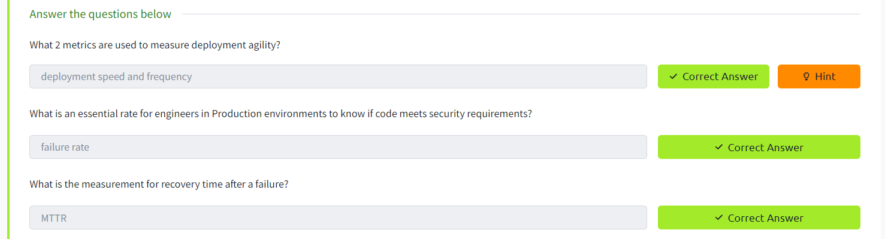

**Production of the Droids**
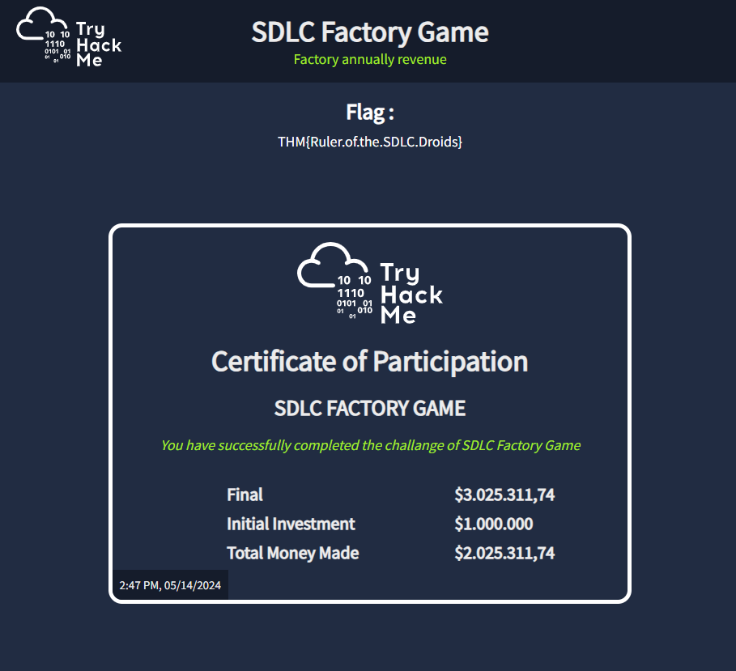
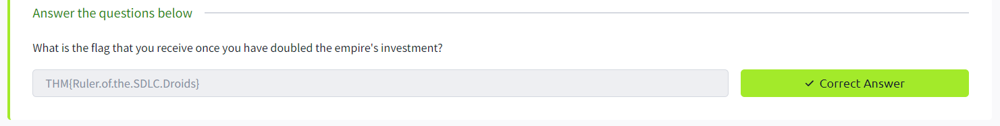

### 1.3 SSDLC
Introduction

**What is SSDLC?**
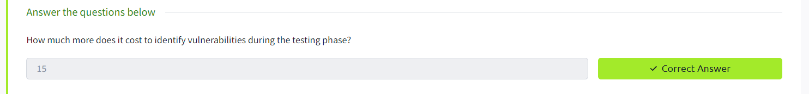

**Implementing SSDLC**
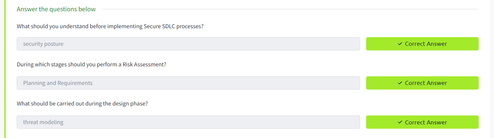

**Risk Assessment**
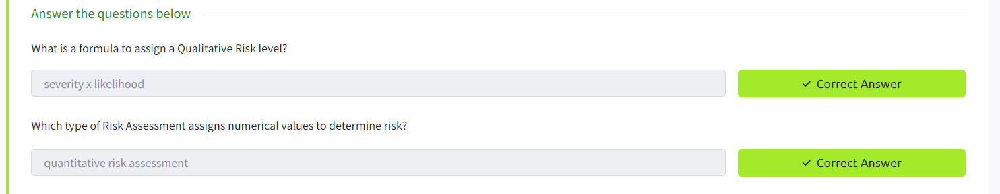

**Threat Modelling**
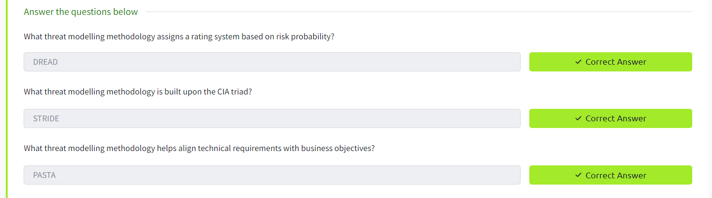

**Secure Coding**

**Security Assessments**
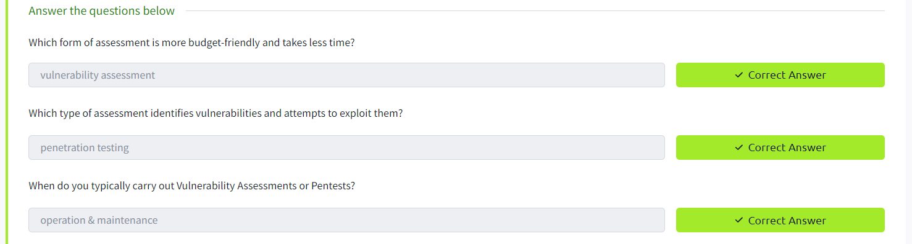

**SSDLC Methodologies**
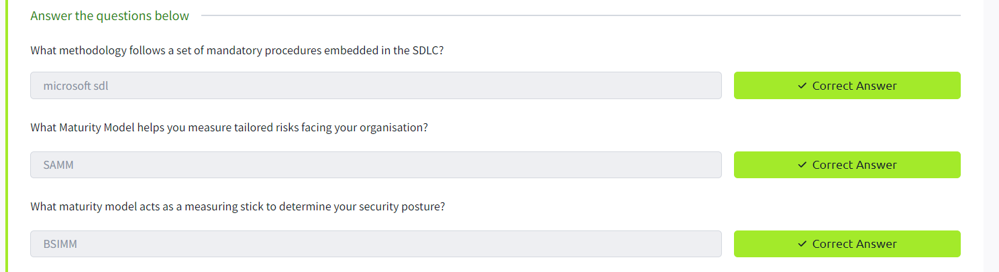

**Secure Space Lifecycle**
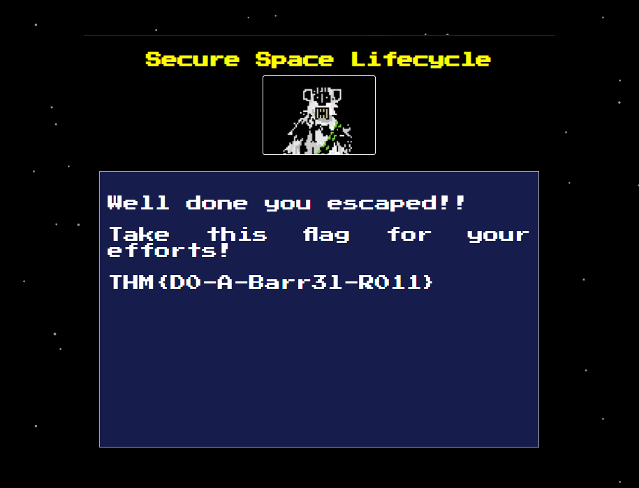
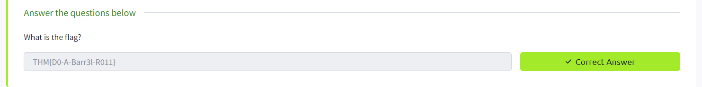

## 2. Security of the Pipeline
### 2.1 Intro to Pipeline Automation

Introduction

**DevOps Pipelines Explained**
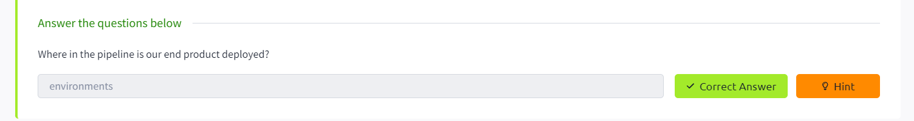

**Source Code and Version Control**
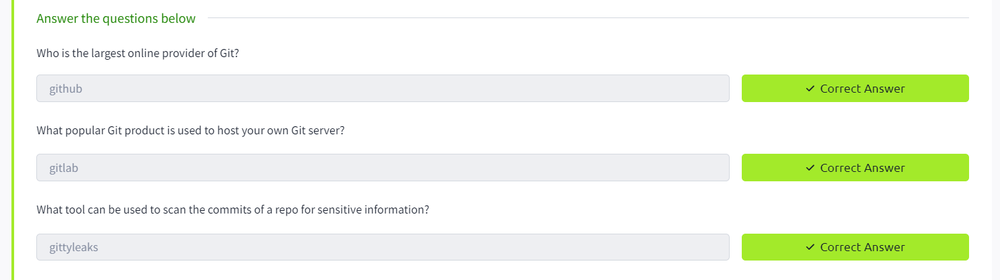

**Dependency Management**
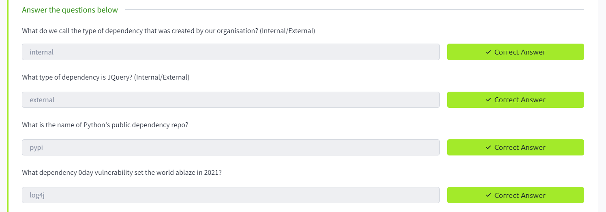

**Automated Testing**
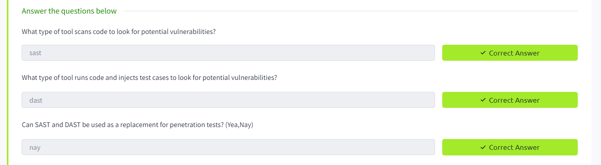

**Continuous Integration and Delivery**
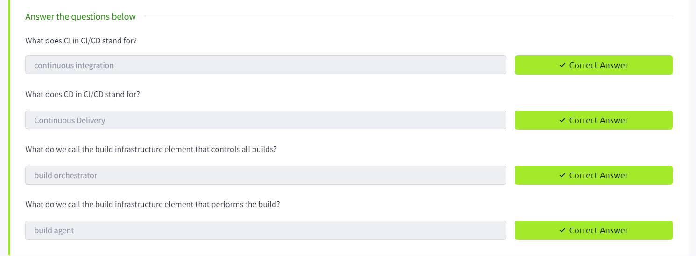

**Environments**
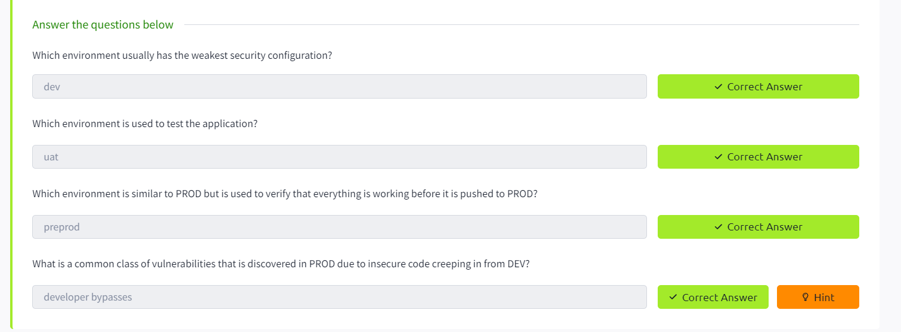

**Challenge**
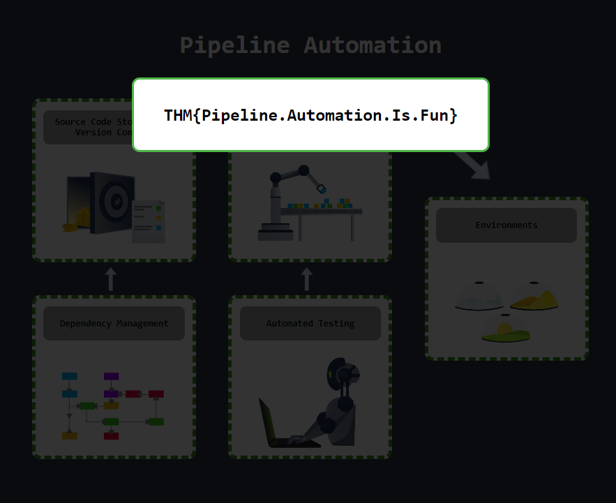
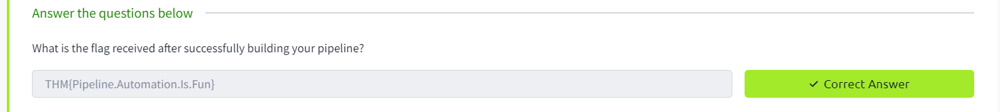

Conclusion

### 2.2 Source Code Security
- paid content
### 2.3 CI/CD and Build Security
- paid content

## 3. Security in the Pipeline
### 3.1 Dependency Management
- paid content
### 3.2 SAST
- paid content
### 3.3 DAST
- paid content
### 3.4 Mother's Secret
- paid content

## 4. Container Security
### 4.1 Intro to Containerisation
### 4.2 Intro to Docker
### 4.3 Intro to Kubernetes
- paid content
### 4.4 Container Vulnerabilities
- paid content
### 4.5 Container Hardening
- paid content

## 5. Infrastructure as Code
### 5.1 Intro to IaC
### 5.2 On-Premises IaC
- paid content
### 5.3 Cloud-based IaC
- paid content
