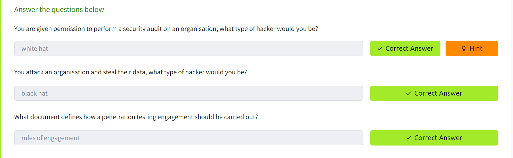

# Jr Penetration Tester
**lembrar de escrever o texto e a pontuação a ser distribuída do joga junto!!!!**

[[#1. Introduction to Cyber Security]]
[[#2. Introduction to Pentesting]]
[[#3. Introduction to Web Hacking]]
[[#4. Burp Suite]]
[[#5. Network Security]]
[[#6. Vulnerability Research]]
[[#7. Metasploit]]
[[#8. Privilege Escalation]]


## 1. Introduction to Cyber Security
### 01. Intro to offensive Security
**What is Offensive Security?**
**O que é segurança ofensiva?**
- Segurança ofensiva: emula as ações dos hackers para encontrar vulnerabilidades no sistema, como exploração de bugs e brechas em aplicações para ganhar acesso não autorizado.
- Segurança defensiva: protege a rede e os sistemas da empresa através da análise e tornando o ambiente seguro contra potenciais ameaças digitais

**Hacking your First machine**
- A atividade simulou o uso do gobuster, uma ferramenta de força bruta para enumerar arquivos e diretórios
- 1. executar o gobuster para listar os repositórios
```bash
# -u: site alvo do scanning
# -w: lista de palavras para ser iterada em busca de páginas ocultas
gobuster -u http://fakebank.com -w wordlist.txt dir
```

- na imagem temos 2 diretórios listados: `/images` e `/bank-transfer`


- acesso a`http://fakebank.com/bank-transfer`


**Careers in cyber security**
- Lista de alguns papéis em segurança defensiva:
	- Pentester: responsável por encontrar encontrar vulnerabilidades de segurança através de testes
	- Red Teamer: faz o papel do adversário, atacando uma organização e provendo o feedback da perspectiva do inimigo
	- Engenheiro de segurança: projeta, monitora e mantém controles de segurança, redes e sistemas para prevenir ataques

### 02. Intro to Defensive Security
**Introduction to Defensive Security**
- Segurança defensiva é centrada em duas principais tarefas:
	- prevenir a ocorrência de invasões
	- detectar invasões e responder de acordo
- Tarefas relacionadas a segurança defensiva:
	- Conscientização do usuário sobre segurança cibernética
	- Documentar e gerenciar ativos: para proteger, é necessário conhecer o que deve ser protegido
	- Atualização e aplicação de patches em sistemas: garantir a atualizaçao para corrigir vulnerabilidades conhecidas.
	- Configurando dispositivos de segurança preventiva: exemplo: firewall e sistemas de prevenção de intrusões (IPS).
	- Configurando dispositivos de registro e monitoramento: para poder detectar atividades maliciosas, é necessário registrar e monitorar a rede, assim saberemos quando um dispositivo da rede não autorizado aparecer.
- 


**Areas of Defensive Security**
- Security Operations Center (SOC)
	- Security Operations Center (SOC) monitora a rede e os sistemas para detectar eventos de cyber segurança maliciosos, suas principais áreas de interesse são:
		- Vulnerabilidades: devem ser aplicados correções ou patches, caso não estejam disponíveis são tomadas medidas para evitar a exploração
		- Violações de políticas: atenção no descumprimento de política de segurança (conjunto de regras para proteção de redes e sistemas) 
		- Atividade não autorizada: ex. detecção e bloqueio de login e senha roubados
		- Invasões de rede
	-  Threat Intelligence
		- Tem como objetivo reunir informações sobre ameaças, para conhecer as táticas, técnicas e procedimentos (TTPs) dos adversários 
- Digital Forensics and Incident Response (DFIR)
	-  Digital Forensics
 		- Analisa evidência de um ataque, seus perpetradores e outras áreas como roubo de propriedade intelectual, cyber espionagem e posse de conteúdo não autorizado.
		- Foco em: sistema de arquivos, memória e logs do sistema, e logs de rede. 
	-  Incident Response
		-  4 fases principais da resposta à incidentes:
			- preparação: equipe treinada e pronta para lidar com incidentes
			- detecção e análise: recursos para detectar e classificar a severidade da ameaça
			- contenção, erradicação e recuperação: uma vez detectado o incidente, deve ser parado (contido), limpo (erradicado) e o ambiente recuperado
			- atividade pós-incidente: geração do relatório sobre o incidente que é compartilhado para prevenir incidentes futuros similares
	-  Malware Analysis
 		- tipos de malware: virus(pedaço de código que se anexa a um programa e é projetado para se espalhar de uma máquina para outra), trojan horse (programa com função desejada, porém com função maliciosa oculta), ransomware(encripta os arquivos do usuário e o atacante solicita o pagamento do resgate para passar a senha de encriptação)
		- principais análises: 
			- análise estática: inspeciona o programa malicioso sem executar o programa
			- análise dinâmica: inspeciona o programa reallizando a exeucção em um ambiente controlado e monitora suas atividades
 


**Practical Example of Defensive Security**


### 03. Careers in Cyber
- Analista de segurança: responsável por manter a segurança dos dados da organização
- Engenheiro de segurança: projeta, monitora e mantém controles de segurança, redes e sistemas para ajudar na prevenção de ataques
- Resposta a incidente: identifica e mitiga ataques enquanto as operações do invasor ainda estão em andamento
- Examinador forense digital: responsável por usar forense digital para investigar incidentes e crimes
- Analista de malware: analisa todos os tipos de malware para aprender mais sobre como elas funcionam e o que fazem
- Pentester: responsável por testar produtos de tecnologia para encontrar falhas de segurança
- Red teamer: faz o papel do adversário, atacando a organização e provendo feedback da perspectiva do inimigo

## 2. Introduction to Pentesting
### Pentesting Fundamentals



### Principles of Security


## 3. Introduction to Web Hacking
### Walking An Application
### Content Discovery
### Subdomain Enumeration
### Authentication Bypass
### IDOR
### File Inclusion
### Intro to SSRF
### Intro to Cross-site Scripting
### Command Injection
### SQL Injection


## 4. Burp Suite
### Burp Suite: The Basics
### Burp Suite: Repeater
### Burp Suite: Intruder
### Burp Suite: Other Modules
### Burp Suite: Extensions

## 5. Network Security
### Passive Reconnaissance
### Active Reconnaissance
### Nmap Live Host Discovery
### Nmap Basic Port Scans
### Nmap Advanced Port Scans
### Nmap Post Port Scans
### Protocols and Servers
### Protocols and Servers 2
### Net Sec Challenge


## 6. Vulnerability Research
### Vulnerabilities 101
### Exploit Vulnerabilities
### Vulnerability Capstone


## 7. Metasploit
### Metasploit: Introduction
### Metasploit: Exploitation
### Metasploit: Meterpreter


## 8. Privilege Escalation
### What the Shell?
### Linux Privilege Escalation
### Windows Privilege Escalation
